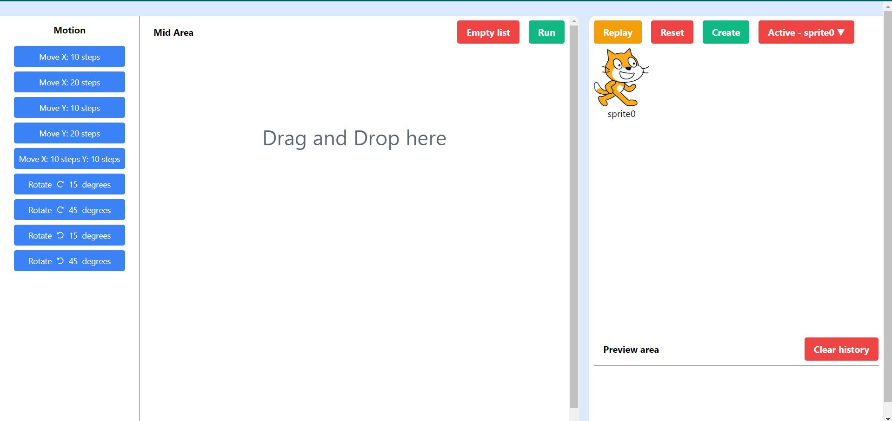

# Scratch Clone

Frontend Assignment

## Introduction

Scratch Clone is a project aimed at replicating the fun and interactive motion features with a Sprite. Explore and play with various motion scripts to bring your Sprite to life in this user-friendly visual programming environment.

## Features

- Drag and drop motion blocks to create a motion script
- Play the motion script by clicking on run button
- Reorder the motion blocks in the script
- See the history of all the motion scripts created
- Create multiple Spites and run motion scripts on them
- Move Sprite in X direction
- Move Sprite in Y direction
- Move Sprite in X and Y direction
- Rotate Sprite in both clockwise and anticlockwise directions
- Change Sprite poition and send it anywhere on the screen
- Replay the motion

## NOTE

- At a time only one motion script can be created and run.
- The motion script can be created by dragging and dropping the motion blocks from the left panel to the mid panel.
- All the motions are implemented one by one(delay of 0.8sec) on the active Sprite.
- To change the active Sprite, choose the desired sprite from the dropdown in the preview area.
- The motion script can be run by clicking on the run button.
- Individual motion can be run and tested by clicking on the respective motion block.
- The motion script can be reordered by dragging and dropping the motion blocks in the mid panel.
- The history of all the motion scripts created can be seen in the right panel.
- You need to give an input to the motion block to see the implementation of motion.
- Press Replay button to replay the motions.

## How to use

`npm install`

`npm start`

## Dependencies

- React JS
- React Beautiful DnD
- React Icons
- Redux Toolkit
- React Redux
- Tailwind CSS

## Screenshots

https://github.com/user-attachments/assets/5f95f7ef-97a5-43f0-928d-6c81fa68d182

